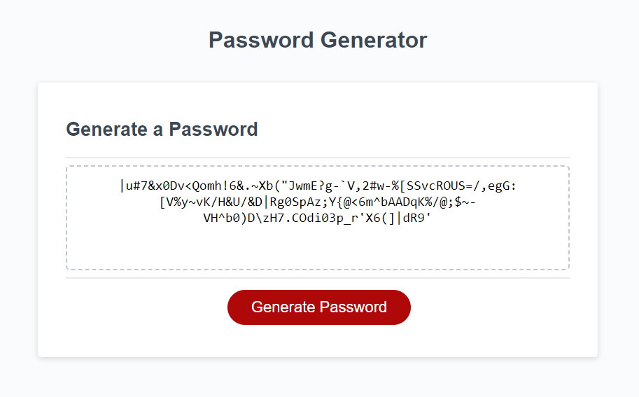

# UT Full-Stack Bootcamp Module 3 Challenge: Password Generation
[Starter Code](https://github.com/coding-boot-camp/friendly-parakeet)

## Main Objective
This website is meant to provide the users with strong, customizable security, by generating a password based on the criteria chosen by the user. These criterias include the length of the password, and the various character types that wil comprise the password. The resulting password is completely random and jumbled up.

## Webpage
[Github Page](https://whatnameshouldiuse.github.io/angelo-password-challenge/)

## License
LICENSE information available in repo